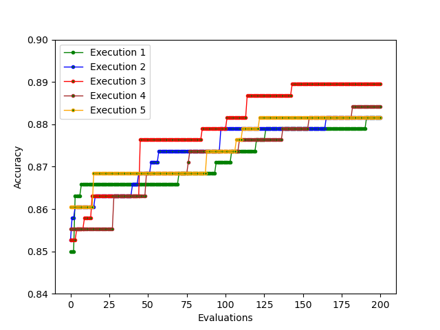

# S-EvoPruneDeepTL

This is the official repository of EvoPruneDeepTL: An Evolutionary Pruning Model: for Transfer Learning based Deep Neural Networks

## Code

The implementation of EvoPruneDeepTL is divided in the following folders:

   * EvoDeepTLPruning FC1 FC2: the folder contains the python files for the one layer approaches.
   * EvoDeepTLPruning Both: this folders contains the python files for the both layer approach.
   * CNN pruning methods: contains the implementation of the compared CNN pruning methods in the paper.
   * configs: contains the configuration files for each analyzed dataset in the paper.
   * convergence images: it contains the images for the convergence of some used datasets.
  
 ### Execution
 
 To execute the code presented above, it is only required:
    
    Python >= 3.6, Keras >= 2.2.4
    
  Then, given the previous folders and a dataset, the command is the following:
  
    python3 main.py configs/configDataset[dataset].csv configGA[Consecutive].csv numberExecution
    
   where:
   
   * dataset names the dataset to analyze.
   * the GA configuration could be the one used for the one layer approach, configGA.csv, or the both layer approach, named configGAConsecutive.csv.
   * numberExecution referes to the number of execution that we are carrying out.
    
 
## Datasets

The used datasets in this paper can be downloaded from:

  * SRSMAS: https://sci2s.ugr.es/CNN-coral-image-classification
  * RPS: https://www.tensorflow.org/datasets/catalog/rock_paper_scissors
  * LEAVES: https://www.tensorflow.org/datasets/catalog/citrus_leaves
  * PAINTING: https://www.kaggle.com/thedownhill/art-images-drawings-painting-sculpture-engraving
  * PLANTS: https://github.com/pratikkayal/PlantDoc-Dataset
  * CATARACT: https://www.kaggle.com/jr2ngb/cataractdataset

## Results

EvoPruneDeepTL is able to optimize sparse layers using a genetic algorithm, giving a neural scheme as it is shown.

The following table shows the average results of EvoPruneDeepTL when the comparison is made against CNN pruning methods.

Moreover, we also show the results of our Feature Selection mechanism against the CNN pruning methods.

.

  

## Convergence Plots

We show some of the convergence plots taken from our experiments:

<ins> First Layer </ins>

| SRSMAS Plot| RPS Plot   | LEAVES Plot|
|------------|------------|------------|
||||
                                                                                                                
<ins> Second Layer </ins>

| SRSMAS Plot| RPS Plot   | LEAVES Plot|
|------------|------------|------------|
||||

<ins> Both Layers </ins>

| SRSMAS Plot| RPS Plot   | LEAVES Plot|
|------------|------------|------------|
||||
